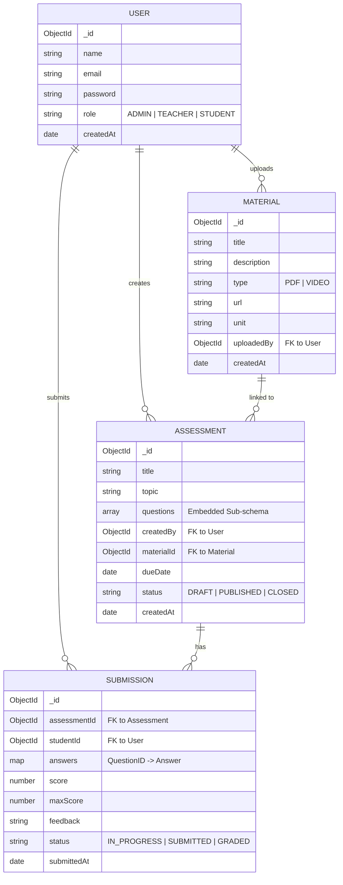

# AI Teaching Assistant - System Design & Architecture

This document provides a comprehensive overview of the AI Teaching Assistant system, including the implemented AI tools, database architecture, and project structure.

## 1. Implemented AI Tools & Features

The system leverages Google's Gemini AI and Pinecone Vector Database to provide a premium formative assessment experience.

### AI Engine (Google Gemini)
- **Model**: `gemini-2.0-flash` for generation and evaluation.
- **Automated Quiz Generation**: Dynamically creates assessments (MCQ & Descriptive) from any topic or material.
- **AI-Powered Grading**: Automatically evaluates student answers, providing scores and personalized constructive feedback.
- **Embedding Generation**: Uses `text-embedding-004` to create vector representations for semantic search and context retrieval.

### RAG (Retrieval-Augmented Generation) System
- **PDF Processing**: Automatically parses uploaded study materials (PDFs).
- **Text Chunking & Indexing**: Breaks down large documents into manageable chunks and stores them in Pinecone.
- **Contextual Awareness**: Retrieves relevant content from the Pinecone vector database to ground AI responses in the provided course materials.

---

## 2. Entity Relationship (ER) Diagram

The following diagram illustrates the data models and their relationships within the MongoDB database.



---

## 3. Project Boilerplate Structure

The project follows a modern full-stack architecture with a clear separation of concerns.

```text
ai-teaching-assistant/
├── backend/                # Node.js/Express Server
│   ├── models/            # Mongoose Schemas (User, Material, etc.)
│   ├── routes/            # API Endpoints (Auth, AI, Assessment)
│   ├── services/          # Business Logic (AI, RAG, File Processing)
│   ├── middleware/        # Auth & Validation Middlewares
│   ├── server.js          # Entry Point
│   └── .env               # Secrets & API Keys
└── frontend/               # React (Vite) Application
    ├── src/
    │   ├── components/    # Reusable UI (Dashboard, Layouts)
    │   ├── services/      # API Interactors (Axios)
    │   ├── App.jsx        # Routing & Main State
    │   ├── index.jsx      # React Entry Point
    │   └── geminiService.js # AI Logic on Frontend
    ├── tailwind.config.js # Styling Configuration
    ├── vite.config.js     # Build Settings
    └── index.html         # HTML Template
```

---

## 4. How to Use
- **Teachers**: Upload PDFs in the "Materials" section to index them for AI. Use the "Generate Assessment" feature to create quizzes automatically.
- **Students**: View assigned assessments, submit answers, and receive instant AI feedback.
- **Admins**: Manage users and oversee system-wide materials and reports.
